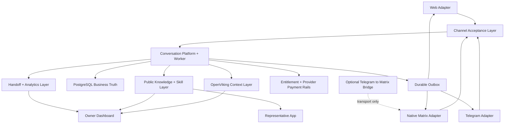

# Delegate Architecture

## Product thesis

Delegate is not a private assistant exposed to the public. It is a separate public runtime that represents a founder or business across Web and optional messaging channels using only public knowledge and explicitly allowed actions.

That single decision drives the whole system:

- public knowledge in
- bounded actions only
- no private workspace access
- paid continuation instead of unlimited free chat
- structured human handoff instead of vague escalation

The channel architecture is governed by [the Unified Conversation Platform ADR](./adr-channel-conversation-platform.md). It replaces the earlier assumption that Telegram must be the primary runtime or that Matrix should become a mandatory hub.

## Scope locked for the current wedge and first channel migration

### In

- Web as the primary shipped entry
- public representative page
- FAQ answering from structured knowledge
- lead qualification and intake
- materials delivery
- paid continuation with `Free`, `Pass`, `Deep Help`, `Sponsor`
- owner inbox for human handoff
- action gate and event audit trail
- native Matrix direct rooms as an optional channel
- Telegram private chat through a thin Telegram adapter
- private-chat/plain-text Telegram-to-Matrix bridge canary only after the direct path is stable

### Out

- WhatsApp
- WeChat
- mandatory Telegram routing through Matrix
- group chat, media parity, history import, full puppeting, and Matrix E2EE in the first channel migration
- private knowledge access
- arbitrary tool calling
- direct calendar mutation
- silent outbound sales or marketing automation
- team-level permission complexity

## System layers

Delegate also ships a separate marketing `Site` service, but it sits outside the runtime loop and acts as the top-of-funnel surface that links into the dashboard and representative app.

For the next-phase target architecture, including the planned isolated compute plane and Claude-inspired capability decisions, see [docs/delegate-architecture-decisions.md](./delegate-architecture-decisions.md).

## Core runtime loop

1. A web, Matrix, or Telegram message enters through its channel adapter.
2. Runtime resolves the audience identity, representative, long-lived channel conversation, and active episode.
3. Inquiry is classified into a channel-neutral disposition such as answer, send public material, collect a request description, create a service request, or hand off.
4. `Action Gate` checks whether the next action is allowed, ask-first, or denied.
5. Pricing and entitlement state decide whether the message stays in free mode, asks once for a request description, or offers paid continuation.
6. Runtime returns one of four next steps:
   - answer directly
   - collect a request description
   - offer paid continuation
   - create human handoff
7. Runtime can recall representative-scoped resources, contact-scoped public-safe memories, and representative agent patterns from OpenViking before composing the next answer.
8. Runtime can commit safe session context after useful turns, collector completions, paid unlocks, and handoff outcomes.
9. The inbound message, generation run, and outbox event are written transactionally with channel idempotency keys.
10. Every step emits an audit event for analytics and future owner review.

The channel-neutral message, episode, version, Matrix, and human-control design is documented in [conversation-platform.md](./conversation-platform.md).

## Data model summary

### Representative

Owns identity, tone, public boundaries, pricing, public knowledge, allowed skills, and handoff policy.

An Owner owns zero or more Representatives. Each representative has an editable working configuration and zero or more immutable `RepresentativeVersion` records. Dashboard setup reads the working configuration; public pages and conversation runtimes read the active or conversation-pinned published version. This prevents unpublished edits from changing live conversations.

### Owner control-plane settings

Owner account settings are independent of every Representative and its publish lifecycle. `accountDisplayName` is private control-plane identity; the existing Owner `displayName` remains the public attribution source. Time zone and preferred locale affect Dashboard presentation only.

Login identifiers and their channel-specific verification state are derived from the connected identity provider rather than edited locally. Notification preferences currently control Dashboard navigation indicators only; they do not imply email, SMS, webhook, or quiet-hours delivery. Profile and notification writes use version checks, idempotency keys, and Owner-scoped audit events.

### Public Knowledge Pack

Structured public content split into:

- identity and positioning
- policies and boundaries
- FAQ
- materials and links

### OpenViking context layer

OpenViking augments, but does not replace, Postgres.

- Postgres remains the source of truth for contacts, conversations, invoices, handoffs, and dashboard analytics.
- OpenViking stores representative-scoped public resources plus public-safe long-term context.
- Resource URIs live under `viking://resources/delegate/reps/{slug}/...`.
- Contact memories live under representative-scoped `viking://user/memories/.../{slug}/{contactId}/...`.
- Agent patterns live under representative-scoped `viking://agent/memories/.../{slug}/...`.
- Delegate stores recall provenance and commit traces in Postgres for debugging and auditability.

### Conversation Contract

Defines:

- free reply limit
- what is allowed in free mode
- when to collect intake
- when to move to paid continuation
- when human handoff is allowed

### Identity, entitlement, and billing

External provider subjects link directly to `AudienceIdentity` after provider-specific proof. Matrix ghosts, Telegram bridge puppets, usernames, and display names are not Delegate account identities. A Contact remains the representative-scoped relationship, while raw conversations stay source-specific.

Tracks:

- audience-and-representative-scoped service entitlements
- provider-specific purchase and refund references
- Web checkout and Telegram Stars as separate payment rails
- paywall decisions, invoice lifecycle, and append-only audit

Provider money is not one fungible balance. Web money and XTR retain their own settlement and refund semantics even when they grant the same product entitlement.

### Handoff and analytics

Tracks:

- structured intake submissions
- why handoff was requested
- whether the requester paid
- whether the owner should personally step in

## Security boundary

The boundary is a first-class product feature, not a prompt convention.

### Can see

- public bio
- public FAQ
- public pricing and materials
- public availability rules

### Can do

- answer FAQ
- collect lead and quote intake
- deliver documents and links
- offer paid continuation
- request human handoff

### Cannot do

- access private memory
- read local files
- execute commands
- log into owner accounts
- change the owner's real calendar
- make irreversible commercial commitments

### Ask first

- discounts
- refunds
- sending sensitive materials
- priority human escalation

## OpenViking operating rules

- OpenViking runs as a standalone HTTP service in Docker for local and production-style development.
- Delegate uses OpenViking's `Create -> Interact -> Commit` session lifecycle.
- Default recall behavior is `L1` first, then `L2` only when the runtime needs more detail.
- If OpenViking is unavailable, or model credentials are missing, Delegate falls back to deterministic policy behavior instead of failing open.
- OpenViking never receives owner-private notes, secrets, wallet internals, or hidden admin context.

## Recommended stack

- `Next.js` for three separate web services: marketing site, representative app, and owner dashboard
- `grammY` for Telegram-specific Bot API, command, callback, deep-link, and Stars behavior at the provider edge
- Matrix Application Service APIs for native Matrix ingress and delivery
- `Prisma + Postgres` for persisted conversations, leads, handoffs, and billing state
- shared `zod` schemas for the boundary between runtime, UI, and future APIs
- `ClawHub` as a discovery source for non-privileged representative skill packs

## Telegram-specific product choices

- Start the shared-runtime migration with private chat and plain text only.
- Use deep links as the main acquisition primitive.
- Use Stars when paid digital service is offered inside Telegram; otherwise keep Telegram paid features disabled and continue the paid interaction on Web.
- Keep commands, callbacks, payment confirmation, refund references, and provider support at the Telegram edge.
- Preserve `sourceProvider=TELEGRAM` even when an optional Matrix bridge carries the event.
- Add group mode only after participant identity, payer/beneficiary, history, and mention-policy semantics are explicitly designed.

## Channel identity and transport rules

- `sourceProvider` identifies the audience-facing provider and determines identity, payment, analytics, and retention semantics.
- `transport` identifies the delivery path and may change without changing the source conversation.
- Web, Matrix MXID, and Telegram numeric user ID bind to `AudienceIdentity` through separate verified links.
- Cross-channel entitlement and approved public-safe memory may be shared; raw message timelines are not automatically merged.
- Inbound acceptance, generation, and outbound delivery enforce the same representative lifecycle, published version, channel state, runtime overlay, entitlement, and human-takeover checks.

## External skill registry policy

OpenClaw's ClawHub pattern is worth adopting, but with a narrower trust boundary than OpenClaw itself.

- Delegate may discover and version representative skill packs from ClawHub.
- Delegate should store source, version, install time, and verification metadata for each installed pack.
- Delegate should not treat ClawHub code plugins as executable authority inside the public representative runtime.
- Only declarative or explicitly reviewed representative workflows should be allowed into production reps.

## Official Telegram references

- Deep links: <https://core.telegram.org/api/links>
- Bot payments: <https://core.telegram.org/bots/payments>
- Telegram Stars payments: <https://core.telegram.org/bots/payments-stars>
- Bot API: <https://core.telegram.org/bots/api>
