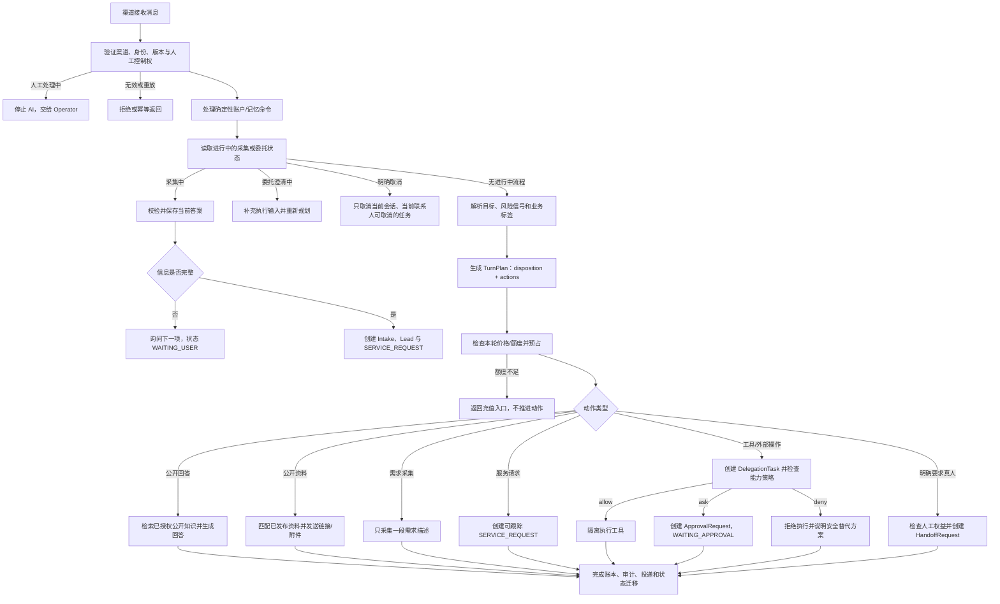

# 数字代表统一对话运行流程

本文是 Web、Matrix、Telegram 公开对话的共同运行契约，也是后续开发和验收依据。固定的 `freeScope`、`paywalledIntents` 和 Owner 业务动作开关已经退出运行时；价格、对话路由、工具授权、审批和人工接手分别由各自的权威模块决定。

## 核心原则

1. 意图识别只描述用户目标，不直接授权动作。
2. 一轮输入可以产生多个有序动作，而不是一个 `nextStep`。
3. 公开回答、资料发送、信息采集、服务请求、工具执行、审批和人工接手是不同对象。
4. 价格策略只判断本轮是否有权继续；不按“招聘、报价、合作”等固定业务标签收费。
5. 只有真实工具或外部副作用才进入 Compute 能力策略。普通需求不会伪装成审批。
6. 用户输入和模型输出都不能扩大权限。平台安全策略可以收紧 Owner 策略，但不能被其放宽。
7. 所有渠道使用同一套计划、账本、状态和幂等规则。

## 端到端主流程

## TurnPlan 协议

当前 `TurnPlan`（代码名 `ConversationPlan`）至少包含：

- `intentResult`：通用目标、多业务标签、请求结果、缺失字段、置信度和风险信号。
- `goal` / `intent`：兼容投影；只用于分析和运营统计，不作为权限或价格真相。
- `disposition`：本轮主要状态，取值为 `answer | collect | payment_required | handoff | refuse`。
- `replyGoal`：本轮用户可见结果，不包含未经授权的事实或承诺。
- `billingDecision`：独立的 `allow_free | allow_entitlement | payment_required | no_charge` 决策。
- `actions[]`：有序动作列表；每项包含输入、所需能力、是否有外部副作用和预计成本。
- `reasons[]`：可审计的路由依据。
- `responseOutline[]`：回复边界，不包含未经授权的事实或承诺。

每个动作独立形成 `AuthorizationDecision` 和 `ExecutionResult`。最终把计划、计费、逐动作授权及执行结果保存为 `ConversationTurnTrace(version=1)`，不能用某个已允许动作替整轮计划授权。

内置对话动作限定为：

| 动作 | 作用 | 副作用 |
| --- | --- | --- |
| `answer_public_information` | 回答已授权公开信息 | 无 |
| `deliver_public_material` | 发送已发布链接或附件 | 无 |
| `collect_request_description` | 保存用户提交的一段需求描述 | 内部记录 |
| `create_service_request` | 创建 Owner 可跟踪的服务请求 | 内部记录 |
| `execute_tool` | 提议受 Compute/MCP 治理的工具执行 | 外部副作用；默认需要审批 |
| `cancel_pending_action` | 撤回当前联系人在当前会话中的待处理任务 | 内部状态；不收费 |
| `request_human_handoff` | 进入人工接手队列 | 人工队列 |
| `refuse_unsafe_request` | 拒绝私有数据、凭据或越权请求 | 无 |

不在此列表中的执行能力由 Skill/MCP/Compute 描述，并进入独立的能力策略。

## 信息采集与服务请求

采集器不再由 Owner 配置，也不按“招聘、报价”等业务标签切换表单。数字代表只询问一次：请用户用一段话描述希望解决的问题或获得的结果。联系人、预算、时间、日程窗口、订单凭据和完成标准等信息，由真人接手后按实际需要继续询问。

完成采集后创建三类记录：

1. `IntakeSubmission`：保留需求描述和必要的运行元数据。
2. `Lead`：用于后续真人跟进和运营视图；不要求数字代表预先收集联系方式。
3. `DelegationTask(kind=SERVICE_REQUEST)`：Owner 可跟踪的业务请求，初始为 `WAITING_FOR_OWNER`。

服务请求本身不授权退款、折扣、日历修改、消息发送或工具调用。Owner 后续可手工处理，或显式转成受策略约束的 Compute/MCP 任务。

## 工具、审批与人工的边界

| 对象 | 何时创建 | 谁决定下一步 |
| --- | --- | --- |
| `SERVICE_REQUEST` | 信息已足够，需要业务处理 | Owner |
| `DelegationTask(COMPUTE/MCP/...)` | 用户明确要求可执行任务 | 能力策略 / 系统 |
| `ApprovalRequest` | 真实能力策略返回 `ask` | Owner 审批 |
| `HandoffRequest` | 用户明确要求真人，或系统确实无法继续且人工权益允许 | Operator / Owner |

禁止用 `HandoffRequest` 代替审批，也禁止用 `ApprovalRequest` 表示普通报价或退款咨询。

## 公开回答与资料

- 事实回答只能使用当前版本允许的、带使用账本的公开知识召回。
- 没有依据时应明确说明资料不足，不使用草稿快照补写事实。
- 资料动作在发送时重新查询当前发布、公开、启用且已审批的资产，不信任较早的运行时快照；私有资产、Owner 备注和未审核附件不可见。
- 资料链接有效期为十分钟，并绑定数字代表、资产、处理版本和内容校验和；每次下载再次检查发布状态。归档、停用、替换或取消公开会立即使旧链接不可用。
- 回复失败时采用 fail-closed 文案，不暗示已搜索、已提交任务或已获得批准。
- 资料交付在渠道确认送达后写入 `MATERIAL_SENT` 审计；只生成回复但投递失败时不记为已发送。

## 入口安全与运行上下文

- 文本最大 12,000 字符，拒绝 NUL 控制字符；每条消息最多 5 个附件、单个 10 MB、合计 20 MB。
- Web 公共入口在写入身份、会话或消息之前执行分布式网络限流，并在解析用户后执行用户分钟限流与数字代表日限流；限流键经 HMAC 后写入 Postgres，不保存原始 IP 或身份标识。
- 附件仅允许明确白名单 MIME；外部链接只接受 HTTP/HTTPS，文件名剥离路径片段。恶意内容扫描由对象存储接入层负责，未通过扫描的对象不能提供可信 `objectKey`。
- `clientMessageId` 与渠道消息 ID 用于入站幂等；渠道来源身份、代表版本和价格策略在创建运行时固定。
- 模型只接收最小化运营状态：当前采集、最近任务的类型/状态/下一负责方、未过期待审批摘要、人工接手状态与未过期可用额度。任务 ID、阻塞原因、私有备注、审批原始 Payload 和工具参数不会进入提示词。
- `/status`、`!status`、“查询当前状态”和“查看当前状态”走确定性状态查询，不调用模型、不消耗对话额度。

## 计费闭环

1. 入站时固定本轮价格策略版本。
2. 免费模式或试用额度使用原子授权，避免多渠道争抢最后一次免费额度。
3. 收费轮次先预占统一服务额度。
4. 只有成功、可计费的结果才消费；失败、取消、租约丢失按账本规则释放或交由终态清理。
5. 审批等待、采集取消、帮助提示和策略拒绝不重复收费。
6. 价格目录是唯一价格真相；对话计划不能创造套餐或价格。

## 状态、幂等与恢复

- 人工控制优先级最高；`HUMAN_ACTIVE` 时 AI 不创建新回答、请求或任务。
- 需求描述采集状态保存在 `Conversation.collectorState`，跨 Worker 重启和跨渠道 Worker 消费可恢复；已开始的旧版多字段会话按原问题继续完成，避免升级后丢失上下文。
- 服务请求以输入消息建立幂等键；相同消息重放不会创建重复任务。
- 工具执行、外部副作用和消息投递各自使用租约与幂等键。
- 任何可能已到达外部系统但结果不确定的操作进入 reconciliation，而不是盲目重试。
- `/cancel`、`cancel`、“取消任务”和“停止当前任务”等精确命令只作用于当前联系人、当前数字代表和当前会话。等待审批或尚未执行的任务可撤回；已经运行的外部动作不会被虚假标记为已取消，而是明确告知可能仍在执行。
- 版本、价格策略、能力策略和知识使用证据必须随运行固定并进入审计。
- Generation 完成与渠道投递分别写入审计；消息真正送达后才记录 `MESSAGE_ANSWERED` 和资料交付事实。

## 兼容迁移

Prisma 中的 `freeScope`、`paywalledIntents` 和 `actionGate` 旧列暂时保留，并在新建记录时写入空值；应用、Dashboard、发布快照和运行时均不再读取它们。线上完成数据迁移与回滚窗口后，可在独立迁移中物理删除这些列。

Telegram 的生产唯一 Owner 为 Conversation Worker。`legacy` / `shadow` 仅保留给本地迁移诊断，并且必须显式设置 `TELEGRAM_CONVERSATION_COMPAT_DIAGNOSTICS_ENABLED=true`；生产环境无条件拒绝这两个模式。兼容窗口结束后再物理删除 grammY 内的旧业务分支。

## 验收清单

- 同一输入在 Web、Matrix、Telegram 产生相同的 TurnPlan 和业务对象。
- 报价、退款、合作等请求先采集并创建服务请求，不自动审批或转人工。
- 只有 Compute/MCP 的 `ask` 决策创建审批。
- 用户明确请求真人时才创建人工队列，并检查人工权益。
- 额度不足时不推进采集、服务请求或工具执行。
- 公开回答无授权资料时 fail closed；公开材料不会泄露私有资产。
- 已签发资料在归档、停用、替换或取消公开后无法继续下载；跨渠道消息使用可访问的绝对链接。
- 用户取消不跨联系人或跨会话命中任务，等待审批可撤回，运行中任务不会被误报为已停止。
- 重放、并发、Worker 重启和租约丢失不会重复扣费、重复执行或重复建单。
