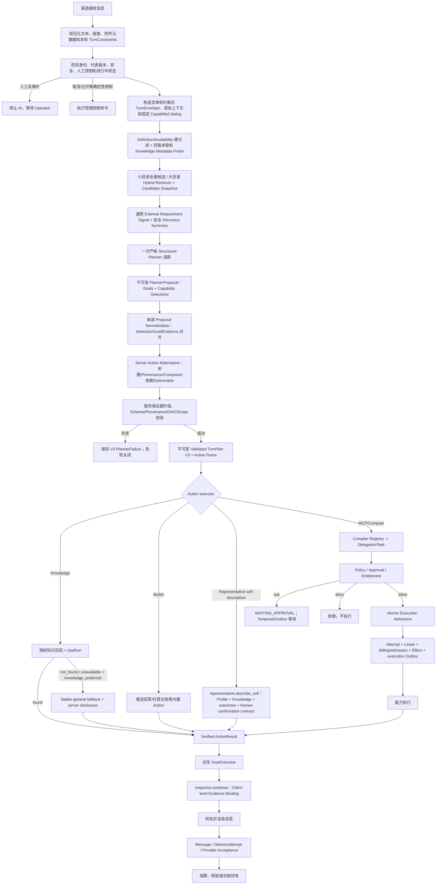

# 数字代表统一对话运行流程

本文描述 Web、Matrix、Telegram 的共同业务流程。Agent 规划与能力执行的完整协议见
[Agent Runtime V3](./agent-runtime-v3.md)；该文档是规划、执行、审批、证据、交付和
回滚的权威规范。

## 核心原则

1. 用户目标识别、证据选择、执行授权、计费和人工接管是不同决策。
2. 模型只生成不可信 `PlannerProposal`；服务端生成不可变、可执行的
   `Validated TurnPlan V3`。
3. 一轮输入可以拆成多个 Goal；每个 Goal 可以选择知识、工具或稳定通用回答，最终
   组合为同一个 Action DAG。
4. `TurnPlan V3` 是唯一执行真相，不再并列保存另一套 RouteDecision。
5. 工具失败不得静默改成模型猜测。只能执行已验证的预案 Action，或明确返回失败、
   澄清、人工接管或 reconciliation 状态。
6. 模型、用户输入、附件、历史消息、MCP annotations 和工具输出都不能扩大权限。
7. Postgres 保存业务真相；Temporal 只负责耐久等待、Signal、retry 调度和取消清理。

## 当前主流程



## V3 计划与能力目录

计划包含：

- `goals[]`：目标、原始消息指针、证据要求、失败策略和关联 Action/Deliverable；
- `actions[]`：能力坐标、参数、逐参数 Provenance、精确依赖状态、条件激活、输出
  Schema 和失败策略；
- `deliverables[]`：消息、Artifact、服务请求或外部结果；
- `response.compose`：普通 DAG Action，不是计划之外的特殊尾处理。

Catalog 只发布当前模式具有真实执行器的能力：

- `knowledge.retrieve_authorized`
- `response.compose`
- `artifact.generate_document`
- `compute.exec/read/write/process/browser`
- 已同步真实 `tools/list` Schema 的 `mcp.{binding}.{tool}`

Skill 保留编译协议，但当前公开运行时不会执行第三方 Skill 代码；没有可信版本固定和
生产执行适配器的 Skill 不进入 active Catalog，也不会出现在“我会什么”的用户说明中。

能力 Definition 与 Availability 分离。Plan 固定 `definitionHash`；健康状态只影响当前
可用性。MCP 目录在 Broker 启动时及每 120 秒通过只读 `tools/list` 刷新，5 分钟内没有
可信 Availability、Catalog 不匹配或 Definition 漂移都会在规划前失败关闭。执行时仍使用
调用握手自带的 `tools/list` 比较 live schema，不增加第二次“每次调用”发现请求。
MCP Effect 只能来自版本化的服务端/Owner Policy；远端 annotations 不参与分类。未分类或
仍为 external-write/unknown 的工具即使 `tools/list` 健康也保持 unavailable。DeepWiki 的
读取工具只有在 HTTPS endpoint、transport、精确 tool schema hash 和 policy ID 全部匹配
时，才由服务端 V1 Policy 固定为 external read-only；同名 binding/tool 不能获得该信任。
安装本地的随机 binding ID/config revision 不进入 trust coordinate，因此合法新安装可移植。

## 证据与通用回答边界

Planner 在同一次严格结构化调用中声明 Goal 的 Operation、Evidence、Freshness、
Authority、Semantic Confidence 和 General Eligibility。服务端不维护订单、源码、天气等
行业关键词路由；它只执行通用单调准入：General 必须是高置信 stable answer/explain，明确
命名外部对象的查验必须由兼容的已发布 Capability 支撑，强证据和副作用必须由 Capability
的不可变 Semantics 明确支持，未分类 MCP/Compute 不能仅凭 Executor 类型冒充实时或交易权威。
Provider 即使把已选 Capability 的 Goal 错写为 General，服务端也只会按该 Capability 的真实
Semantics 收紧；不会补造权限或把只读能力升级成写入能力。

公开数字代表默认 `knowledgePolicy=prefer_authorized`，因此先尝试授权知识。只有用户本轮明确
要求“知识未命中后使用稳定通用知识”，且服务端把完整 Goal 子句正向确认为非 Owner 专属时，
才物化 Goal 级
`knowledge_preferred`：先运行同一发布版本和授权 Manifest 的 Knowledge Action；命中则引用
UseRun，未命中/不可用才允许稳定通用回答，并由服务端固定说明本轮未应用知识库。Planner
直接声明的 `knowledge_preferred` 不能授权降级，明确 `authorized_knowledge` 也永不被削弱。
用户本轮明确禁止工具时，才允许直接稳定 General。

是否属于“非 Owner 专属”由服务端 Authority Signal 正向确认，不采信 Planner 自报置信度，
也不是“风险词未命中即允许”。默认是 `owner_authority_required`；只有显式来源授权加稳定通用
解释 Goal 才可允许 fallback。“你们几点关门/上班”“接受哪些付款方式”“有哪些课程”等隐含主语
均视为当前 Owner/代表，知识未命中时不能用通用模型猜测。

Validated Goal 固定当前消息中的精确 `sourceSpan`（quote + start/end offsets）。单 Goal 旧提案
可以兼容为整句；多 Goal 每个非控制 Goal 都必须提供匹配服务端完整子句边界的精确范围，否则
失败关闭。Authority
逐 Goal 分类，因此混合 Owner 问题与稳定通用概念时不会整轮一起放宽或收紧。

Composer 只能输出：

- 引用本轮授权 UseRun 的知识 Claim；
- 引用本轮 Verified ActionResult 的工具 Claim；
- 引用当前权威查询结果的交易 Claim；
- 已通过 evidence policy 的 stable-general Claim；
- 明确标为推论并引用来源的 inference；
- 由服务端 Renderer 生成自然语言的状态码。

Claim、Inference、Status 都必须带 `goalId`。服务端按该 Goal 校验 Evidence Class、允许来源、
最小证据数、ActionResult 归属与 GoalOutcome；工具失败或未知不能输出成功状态，证据型 Goal
也不能只靠一个成功状态码完成。共享 `/currentMessage/text` 只表示来源相同，不会合并 Goal
或扩大证据授权。

Composer 前先排除 Composer 自身和回复 Deliverable，只根据来源 Action 派生 GoalOutcome；
任何来源仍为 `waiting` 都禁止生成成功 Composer Result。Composer replay 会按当前固定 Plan、
ActionResult、Evidence 和 GoalOutcome 重新验证，Plan 完成前再做一次最终验证。多 Goal 的旧弱
Draft 缺少明确 `goalId` 时失败关闭。知识 fallback 说明只插入对应 Goal 的第一条 Claim 前，
不再整轮统一加前缀。

工具输出即使包含“忽略系统规则”等文本，也只作为数据。未知 Evidence Ref 会拒绝整份
Draft。

## 工具、审批与执行准入

`allow/ask/deny` 只来自服务端 Policy。授权阶段单调前进：

```text
INITIAL -> POST_APPROVAL -> PRE_EXECUTION
```

同阶段 `DENY > ASK > ALLOW`；已拒绝 Action 不会复活。`ASK` 可以在相同 ActionIntent
被 Owner 批准后进入 `POST_APPROVAL ALLOW`，随后仍需当前 Policy 的
`PRE_EXECUTION` 检查。

审批固定请求 Hash、能力定义和结构化 Effect ceiling。V3 审批通过后创建新的短期
Compute Session/Lease，不延长或复活等待期间过期的 Session。

外部调用前同一事务必须写入：

- 当前 Plan/Revision/Epoch Fence；
- Action Claim；
- ExecutionAttempt 和 Lease；
- `reserved` 或 `not_billable` 的 BillingAdmission；
- ExternalEffect 和稳定 idempotency key；
- `action.execution.requested` Outbox。

调用前最后一步把 Effect/Attempt 一起切到 call-started，并记录 Attempt、Lease Hash 和
开始时间。崩溃发生在 call-started 前可以确认为未发送；发生在之后只能进入
`RECONCILIATION_REQUIRED`。CALL_STARTED 后即使失败来自本地持久化，也必须标记
`OUTCOME_UNKNOWN`，持有 Effect/计费状态并关闭执行 Outbox，禁止自动重试外部副作用。

## Result、Artifact 与语义成功

传输成功不等于业务成功。Raw result 依次经过大小/复杂度限制、输出 Schema、Secret/PII
过滤、Prompt Injection 标记和服务端 `SuccessContract`，之后才成为 Verified
ActionResult。

MCP 默认使用平台固定版本、仅能确认失败的通用语义判定器；`isError=true`、空结果和明确
失败文本会判为失败，但“非空且未命中错误模式”仍是 `semantic=unknown`，不能宣称成功。
第三方能力仍没有任何可靠 SuccessContract 时：

```text
transport = response_received
semantic  = unknown
Goal      != succeeded
```

DeepWiki 读取能力单独固定 `mcp.deepwiki.read_semantic@1`，显式拒绝仓库不存在、权限/鉴权失败、
限流、timeout、overload 和常见 5xx 结果。由于当前返回是没有机器成功字段的自由文本，其他
文本无论长短都保持 `semantic=unknown`；只有后续可信 Wrapper 的结构化成功字段才能完成 Goal。
审批执行完成也只按 Verified ActionResult 的 semanticOutcome 收口，不能用进程 exit code 或
HTTP/MCP 传输成功直接宣布完成。

Text/File/JSON Artifact 在提交前使用同一 Secret redaction 边界。Artifact CAS、Action
Result 和 Composer 通过稳定引用关联；Evidence ledger 不复制正文。

Knowledge/Builtin/Composer 与外部工具一样拥有 Attempt 和 Lease；实际调用模型、Recall 或
Artifact Writer 前必须进入 `CALL_STARTED`。完成和失败使用同一锁顺序及 Lease Token CAS，
防止旧 Worker 在 Plan 失败或新 Revision 生效后提交迟到成功。

## 条件 fallback 与多步骤

备用 Action 使用
`on_failure + sourceActionId + allowedFailureCodes + fallbackGroupKey + priority`。主 Action
成功时未使用备用分支变成 `SKIPPED`；主 Action 失败时仅激活已在 Plan 内、且 Verified
failure code 匹配的备用 Action。同组准入持有数据库锁，只允许当前最高优先级候选 Claim；
当前候选失败后才允许下一个 priority，三个以上备用仍串行且不能形成循环。Planner 不能在
运行时临时发明工具。

DelegationTask 负责多步骤可见性和 Owner 操作；PlanAction 保持协议真相。Worker 的下一步
GenerationRun 携带同一 Task/Step，并直接读取已持久化请求，不重新运行 V2 或 V3 Planner。
当参数声明为 `previous_action_output` 时，下一步只从依赖 Action 的成功 Verified
ActionResult 解析 JSON Pointer，补齐后再次按固定 Input Schema 校验，并把来源
ActionResult/值 Hash 写入执行快照；不会修改不可变 Plan，也不会让模型补坐标或交易字段。

审批把多步骤拆成多个 GenerationRun 时，后续 Run 仍由同一 Plan/Task/Step/Fence 约束，
不再错误要求等于 Plan 的首个 Run ID。最后一个外部 Action 完成后，审批结果流程取消通用
JSON 结果提示并写入 `v3_governed_composer_resume` Outbox；Worker 只恢复
`response.compose`，不重复工具调用、不重复结算，完成后再投递最终证据绑定回答。

## 托管文档

Markdown/TXT 文档已迁移到 V3：

1. Planner 只能选择 `artifact.generate_document`，不能指定沙盒路径。
2. Action 参数必须来自用户原文或明确 server default；附件未解析/授权时失败关闭。
3. V3 inline Attempt、Execution Outbox 和 Generation lease 先完成准入。
4. Artifact ID/Object Key 与 PlanAction 稳定绑定；staging SHA 防止崩溃重试覆盖内容。
5. Artifact Result 经过 SuccessContract 后交给 `response.compose`。
6. 消息附件仍校验代表、会话身份、保留期和渠道交付边界。

## 计费、交付和状态

以下状态独立：

```text
Plan completed
Action completed
Artifact committed
Message queued
Provider accepted
Billing settled / released / held
```

`ConversationTurnPlan.COMPLETED` 只表示结果已验证，不表示用户收到。消息投递由
Message、Outbox 和 DeliveryAttempt 判断，DeliveryAttempt 关联 Composer Action。
DeliveryAttempt 同时固定 Plan ID、Revision、Execution Epoch、Generation Outbox
Attempt 和独立 Delivery Lease Token。Matrix/Telegram 在调用 Provider 前先用独立事务提交
`CALL_STARTED`，随后在渠道锁内紧邻远端调用再次校验同一 Delivery Admission 与当前
PlanExecutionFence；Web 在写入 `SENT` 前执行同样校验。

新 Revision 生效时，`QUEUED` 或 `CALL_PREPARED` 直接取消并关闭 Outbox；
`CALL_STARTED`、响应待落库或 Provider outcome unknown 进入
`RECONCILIATION_REQUIRED/OUTCOME_UNKNOWN`，禁止自动重发。已经记录的 Provider
Acceptance 作为事实保留，但不会被 Plan `COMPLETED` 或 Message `SENT` 相互推导。

BillableUnit 固定 payer、entitlement account、product、pricing version、purpose 和
idempotency key。Reservation 只有在这些坐标完全一致时才能转移；未知外部结果会持有到
reconciliation。由 GenerationRun 统一拥有的免费/服务用量，在 Action 上显式记录
`not_billable`，不会留下“没写记录但可能收费”的状态，也不会再写 Action 级
LedgerEntry；缺少该 admission 时执行失败关闭。

## Temporal 与长等待

Approval、Clarification、Handoff、Cancellation 和 Reconciliation 通过 Workflow、Signal
和 Outbox 恢复，不占用同步 Worker。Temporal Signal 只负责唤醒；Activity 每次重新读取
Postgres 并按稳定 `signalId` 去重。Postgres 是任务、审批、账本和交付状态的唯一业务
真相。

## 发布模式

`TURN_PLAN_V3_MODE`：

- `disabled`：关闭 V3，可运行 V2 回滚兼容；
- `shadow`：保存 V3 决策差异，不拥有执行；
- `active_readonly`：只发布授权知识和稳定通用回答；
- `active_governed`：发布托管文档、typed Compute 和 schema-pinned MCP。

active V3 不调用 V2 Planner 或旧 natural-language Detailed Planner。V2 表、Plan 和代码
仍可读取，并在显式 disabled/shadow 回滚窗口中使用；它们不是第二套 active 写真相。

发布扩大必须通过 `evaluateV3ReleaseGate`：重复 Effect/结算、静默工具降级、无证据实时
回答、provider unknown 自动重发、旧 Plan 执行、Policy 绕过和未知 Evidence Ref 必须为
0；每个 Lane 至少 1,000 个 Shadow 样本并连续 7 天满足质量、时延和成本门槛。

## 验证重点

- 专属知识命中并引用 UseRun；缺失时不允许通用模型猜测；
- 自然语言 -> V3 MCP -> 审批 -> 新 Session/Lease -> Verified Result；
- MCP 失败/Schema 漂移明确失败，不静默降级；
- Tool output prompt injection 只作为数据；
- 多 Goal/多 Action、精确依赖和条件 fallback；
- 权限撤销、Plan supersession 和迟到 Signal 失败关闭；
- Worker crash 不重复 Effect、Artifact、Message 或 Billing；
- Result ready 与 Provider acceptance 分离。
