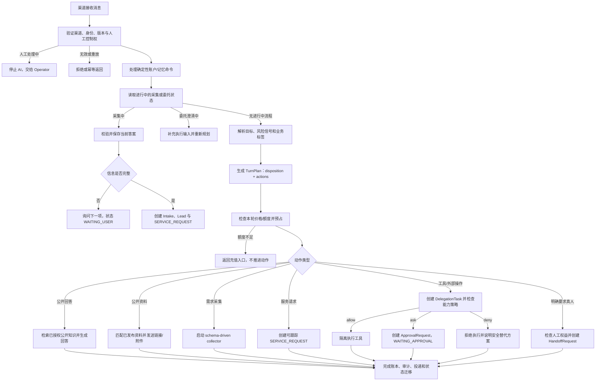

# 数字代表统一对话运行流程

本文是 Web、Matrix、Telegram 公开对话的共同运行契约，也是后续开发和验收依据。固定的 `freeScope`、`paywalledIntents` 和 Owner 业务动作开关已经退出运行时；价格、对话路由、工具授权、审批和人工接手分别由各自的权威模块决定。

## 核心原则

1. 意图识别只描述用户目标，不直接授权动作。
2. 一轮输入可以产生多个有序动作，而不是一个 `nextStep`。
3. 公开回答、资料发送、信息采集、服务请求、工具执行、审批和人工接手是不同对象。
4. 价格策略只判断本轮是否有权继续；不按“招聘、报价、合作”等固定业务标签收费。
5. 只有真实工具或外部副作用才进入 Compute 能力策略。普通需求不会伪装成审批。
6. 用户输入和模型输出都不能扩大权限。平台安全策略可以收紧 Owner 策略，但不能被其放宽。
7. 所有渠道使用同一套计划、账本、状态和幂等规则。

## 端到端主流程

## TurnPlan 协议

每轮计划至少包含：

- `goal`：通用目标，如获取信息、获取资料、创建请求、执行动作、请求真人或不安全请求。
- `intent`：内部业务标签，只用于分析、采集模板和运营统计，不作为权限或价格真相。
- `disposition`：本轮主要状态，取值为 `answer | collect | payment_required | handoff | refuse`。
- `actions[]`：有序动作列表，每项声明动作类型和副作用等级。
- `reasons[]`：可审计的路由依据。
- `responseOutline[]`：回复边界，不包含未经授权的事实或承诺。

内置对话动作限定为：

| 动作 | 作用 | 副作用 |
| --- | --- | --- |
| `answer_public_information` | 回答已授权公开信息 | 无 |
| `deliver_public_material` | 发送已发布链接或附件 | 无 |
| `collect_contact_and_requirements` | 保存用户主动提供的联系人和需求 | 内部记录 |
| `create_service_request` | 创建 Owner 可跟踪的服务请求 | 内部记录 |
| `request_human_handoff` | 进入人工接手队列 | 人工队列 |
| `refuse_unsafe_request` | 拒绝私有数据、凭据或越权请求 | 无 |

不在此列表中的执行能力由 Skill/MCP/Compute 描述，并进入独立的能力策略。

## 信息采集与服务请求

采集器采用 schema 驱动，而不是把“招聘、报价”等选项写死成 Owner 配置：

- 报价/合作模板：身份、目标、预算、时间、人工偏好。
- 预约模板：沟通类型、议题、时区、候选时间、付费背景。
- 通用服务请求模板：联系人、目标、背景与约束、时间与完成标准。

完成采集后创建三类记录：

1. `IntakeSubmission`：保留结构化原始答案。
2. `Lead`：用于联系人阶段和运营视图。
3. `DelegationTask(kind=SERVICE_REQUEST)`：Owner 可跟踪的业务请求，初始为 `WAITING_FOR_OWNER`。

服务请求本身不授权退款、折扣、日历修改、消息发送或工具调用。Owner 后续可手工处理，或显式转成受策略约束的 Compute/MCP 任务。

## 工具、审批与人工的边界

| 对象 | 何时创建 | 谁决定下一步 |
| --- | --- | --- |
| `SERVICE_REQUEST` | 信息已足够，需要业务处理 | Owner |
| `DelegationTask(COMPUTE/MCP/...)` | 用户明确要求可执行任务 | 能力策略 / 系统 |
| `ApprovalRequest` | 真实能力策略返回 `ask` | Owner 审批 |
| `HandoffRequest` | 用户明确要求真人，或系统确实无法继续且人工权益允许 | Operator / Owner |

禁止用 `HandoffRequest` 代替审批，也禁止用 `ApprovalRequest` 表示普通报价或退款咨询。

## 公开回答与资料

- 事实回答只能使用当前版本允许的、带使用账本的公开知识召回。
- 没有依据时应明确说明资料不足，不使用草稿快照补写事实。
- 资料动作只能发送当前发布版本中的公开材料；私有资产、Owner 备注和未审核附件不可见。
- 回复失败时采用 fail-closed 文案，不暗示已搜索、已提交任务或已获得批准。

## 计费闭环

1. 入站时固定本轮价格策略版本。
2. 免费模式或试用额度使用原子授权，避免多渠道争抢最后一次免费额度。
3. 收费轮次先预占统一服务额度。
4. 只有成功、可计费的结果才消费；失败、取消、租约丢失按账本规则释放或交由终态清理。
5. 审批等待、采集取消、帮助提示和策略拒绝不重复收费。
6. 价格目录是唯一价格真相；对话计划不能创造套餐或价格。

## 状态、幂等与恢复

- 人工控制优先级最高；`HUMAN_ACTIVE` 时 AI 不创建新回答、请求或任务。
- 采集状态保存在 `Conversation.collectorState`，跨 Worker 重启和跨渠道 Worker 消费可恢复。
- 服务请求以输入消息建立幂等键；相同消息重放不会创建重复任务。
- 工具执行、外部副作用和消息投递各自使用租约与幂等键。
- 任何可能已到达外部系统但结果不确定的操作进入 reconciliation，而不是盲目重试。
- 版本、价格策略、能力策略和知识使用证据必须随运行固定并进入审计。

## 兼容迁移

Prisma 中的 `freeScope`、`paywalledIntents` 和 `actionGate` 旧列暂时保留，并在新建记录时写入空值；应用、Dashboard、发布快照和运行时均不再读取它们。线上完成数据迁移与回滚窗口后，可在独立迁移中物理删除这些列。

## 验收清单

- 同一输入在 Web、Matrix、Telegram 产生相同的 TurnPlan 和业务对象。
- 报价、退款、合作等请求先采集并创建服务请求，不自动审批或转人工。
- 只有 Compute/MCP 的 `ask` 决策创建审批。
- 用户明确请求真人时才创建人工队列，并检查人工权益。
- 额度不足时不推进采集、服务请求或工具执行。
- 公开回答无授权资料时 fail closed；公开材料不会泄露私有资产。
- 重放、并发、Worker 重启和租约丢失不会重复扣费、重复执行或重复建单。
