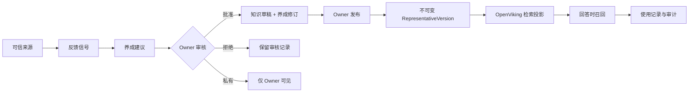
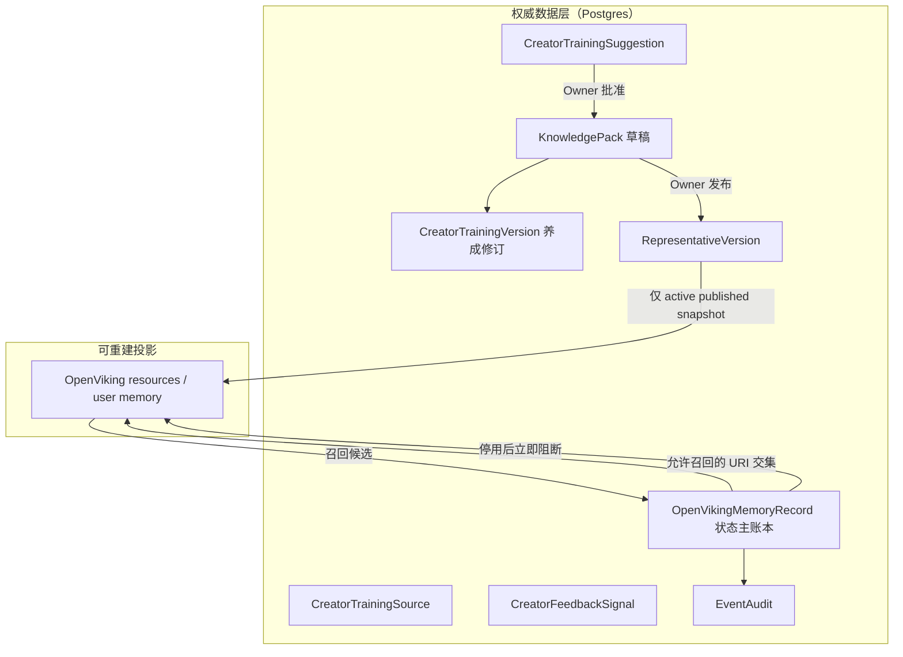
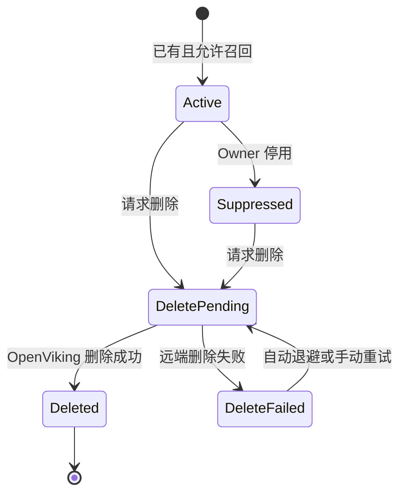

# 代表养成模块开发计划

状态：开发完成，最终回归通过
日期：2026-07-31
目标分支：`codex/dashboard-optimization`

## 1. 需求结论

将 Dashboard 顶部的“公开记忆”改为“养成”是合理的，但“养成”不应等同于
OpenViking 记忆列表。

仓库中已经存在完整的 Creator Training Loop：

1. Owner 注册或上传可信来源；
2. 会话反馈进入待处理信号；
3. 系统基于来源与反馈生成建议；
4. Owner 审核建议，可批准、拒绝或标记为私有；
5. 批准结果更新知识草稿，并生成不可变的养成修订；
6. Owner 另行发布新的 `RepresentativeVersion` 后，变化才会影响公开回答；
7. 可查看养成修订历史并安全回滚知识草稿。

这条闭环应成为“养成”的主流程。OpenViking 只承担已发布知识和经过治理的长期上下文的
检索投影，不作为业务真相来源，也不直接决定公开知识、价格、支付或权限。

## 2. 产品边界

### 本次必须完成

- 顶部信息架构将“公开记忆 / Public Memory”改为“养成 / Development”。
- 接入现有真实养成驾驶舱，移除该入口下的静态示例数据。
- 在养成模块中区分：
  - 可信来源；
  - 待审核反馈和建议；
  - 已应用的养成修订；
  - 记忆投影及使用记录。
- “批准建议”只进入知识草稿；必须再发布新的 `RepresentativeVersion` 才能影响公开回答。
- 养成审核必须由服务端重新评估，且只允许审核 `PENDING` 建议。
- 同一条建议的草稿内容一旦生成即保持不可变；新证据生成 successor，并把同一来源的旧待审核建议标记为已取代。
- 数据库 partial unique 约束保证每个代表、每个来源同时最多一条待审核建议；整理与审核共享同一事务锁。
- 同一来源写入知识草稿时使用稳定文档 ID 并执行替换，不能产生新旧冲突副本。
- 每个代表的养成修订使用数据库约束保证的单调修订号；知识草稿 revision、设置、批准和回滚共同构成乐观并发保护。
- 只有最新、且当前知识仍与其 `snapshotAfter` 一致的养成修订可以回滚。
- OpenViking 同步只读取当前已发布版本，不读取 Owner 尚未发布的草稿。
- 发布或激活与同步任务必须在同一数据库事务中提交；任务通过租约、退避和版本栅栏恢复执行，旧任务不得覆盖新版本状态。
- 默认关闭自动会话捕获，并关闭支付、collector、handoff 等未经审核的长期写入。
- Agent 全局记忆不参与面向访客的 Recall，防止不同联系人之间的信息串漏。
- 遗留记忆支持立即停用和远端删除；远端失败时仍保持本地不可召回。
- 删除任务支持崩溃恢复和自动退避重试；手动重试只是补充入口。
- 相关私有 API 使用 `private, no-store` 响应策略。
- 公开聊天页明确说明记忆是否启用、聊天不会自动成为公开知识。
- 增加配置、同步、停用、删除的安全审计。

### 本次不做

- 不构建新的模型自动抽取或 DLP 系统。
- 不承诺 Telegram、Matrix、Web 等所有渠道的自动养成。
- 不把支付事实、权益状态或私有备注写入 OpenViking。
- 不把召回次数包装成“实际影响回答”的指标；只有真正注入生成上下文的记录才可称为使用。
- 不做新的向量数据库或 OpenViking 多租户架构改造。

## 3. 方案比较

### 方案 A：只改名称并挂接现有 OpenViking 页面

实现快，但会把原始 URI、L2、trace 等内部概念暴露给普通 Owner，也无法解决草稿泄漏、
跨联系人信息串漏和无法删除的问题。

结论：不采用。

### 方案 B：复用养成闭环，OpenViking 作为受治理投影

复用已有来源、反馈、建议、审核、版本和回滚能力；在同一模块中将 OpenViking 降级为
“记忆与使用”支撑视图。Postgres 和已发布版本是权威数据，OpenViking 可以重建。

结论：本次采用。

### 方案 C：建设完整跨渠道候选记忆平台

增加结构化提取、PII/DLP、TTL、用户自助删除、渠道一致性、可解释引用和离线评估。

结论：作为后续演进，不进入本次范围。

## 4. 信息架构

Dashboard 的“养成”页面使用四个清晰分区：

1. **来源**：已登记文档、上传内容及处理状态。
2. **待审核**：反馈与建议，支持批准、拒绝、私有。
3. **修订**：已应用的养成修订、变化摘要和知识草稿回滚。
4. **记忆与使用**：投影健康、已治理记忆、召回记录和删除操作。

## 5. 数据与信任边界

安全规则：

- `RepresentativeVersion` 的 active snapshot 是知识同步唯一来源。
- `OpenVikingMemoryRecord` 是投影状态主账本；缺少本地活动记录的 URI 不得被召回。
- 删除采用“先本地 suppress，再远端 purge”；远端失败不会恢复召回。
- `agent://` 范围不进入访客会话召回。
- 自动捕获在环境变量、数据库默认值和 API 校验三层关闭。
- 任何布尔配置都必须严格解析，不能使用 `Boolean("false")` 之类的宽松转换。

## 6. 记忆生命周期

所有非 `Active` 状态都不可召回。当前 Dashboard 不提供 `Suppressed` 恢复操作；删除不可逆。
删除进程中断或远端失败时，后台会通过租约超时和指数退避自动恢复，Owner 也可以手动触发重试。

## 7. 实施步骤

### 阶段 1：安全基线

- 扩展记忆主账本字段和生命周期枚举。
- 增加迁移：自动捕获默认值改为关闭，并关闭现有配置。
- 收紧 OpenViking 配置解析和目标 URI 范围。
- 禁止会话、collector、payment、handoff 自动长期写入。
- Recall 移除 agent 范围，并以活动主账本记录和发布快照做最终过滤。
- 为 KnowledgePack 增加 revision token；过期设置保存返回 409，并在客户端刷新最新草稿。

### 阶段 2：发布投影

- 同步逻辑改为读取 active `RepresentativeVersion` snapshot。
- 发布、激活与同步 job 在同一事务内提交，避免发布成功但同步任务丢失。
- 后台 runner 通过 claim、lease、指数退避执行任务，并以 active version 和最新 job 双重栅栏保护聚合状态。
- 没有已发布版本时返回明确的阻断状态，不同步草稿。
- 发布快照固定知识资产校验和及处理版本；同步记录代表版本、结果和错误。
- 为停用、删除和重试增加 API 与安全审计。
- 记录由服务端认证会话解析出的操作人；后台恢复沿用最初的可信操作人。

### 阶段 3：养成 Dashboard

- 将 `memory` 路由接入真实养成页面。
- 中文标题使用“代表养成”，英文使用“Representative Development”。
- 将 OpenViking 页面改为“记忆与使用”支撑区域，隐藏底层 URI/L2 等实现术语。
- 展示空、加载、失败、无已发布版本、删除失败和重试状态。
- 颜色只作为辅助；状态必须同时有文本和可访问标签。
- 文案和操作明确区分“审核并加入知识草稿”与“发布代表版本”，避免虚假发布承诺。
- 移除客户端提交评估结论的能力；服务端重新评估每次审核。
- `publicSafe=false` 的任何反馈都不得生成共享知识建议。
- 建议按稳定 origin 和单调代际分组；新证据原子取代旧待审核项，A→B→A 会创建新的 A 代际，已审核历史保持不可变，且始终最多只有一个可审核版本。
- 设置 CAS 成功后才保存知识资产绑定，冲突时不产生部分保存。
- 设置 CAS 已提交但绑定请求失败时，客户端必须先接纳新的草稿 revision，再提示并允许重试绑定。

### 阶段 4：公开端信任披露

- 展示当前记忆能力是否启用。
- 明确聊天不会自动变成公开知识。
- 区分公开知识引用和经过治理的长期上下文。
- 不展示内部 URI、模型分数、运行追踪或私有备注。

## 8. 错误恢复

| 场景 | 用户可见状态 | 系统行为 | 恢复动作 |
| --- | --- | --- | --- |
| 尚无已发布版本 | 尚未发布，无法同步 | 不读取草稿 | 引导先发布版本 |
| OpenViking 不可用 | 记忆服务暂不可用 | 主业务继续，本地状态不变 | 重试同步 |
| 同步 worker 中断 | 同步中或等待重试 | 租约到期后重新接管；旧版本任务不能覆盖新状态 | 后台自动恢复 |
| 删除远端失败 | 已停用，删除待重试 | 立即阻断召回并安排指数退避 | 后台自动恢复或 Owner 手动重试 |
| 删除 worker 中断 | 已停用，删除处理中 | 租约过期后重新接管 | 后台自动恢复 |
| 配置值非法 | 保存失败并指出字段 | 不写入数据库 | 修正后重试 |
| 训练来源处理失败 | 来源处理失败 | 不生成建议 | 重试处理或移除来源 |
| 召回返回未知 URI | 不展示、不注入 | 丢弃候选且不写入召回记录 | 检查索引漂移 |

## 9. 发布和回滚

- 数据库迁移必须先兼容旧记录，再发布应用代码。
- 自动捕获关闭属于安全收缩，不通过回滚重新开启。
- UI 可独立回滚到旧入口，但新安全过滤和删除主账本应保留。
- OpenViking 投影可从 active published snapshot 重建。

## 10. 需求复核结论

该需求没有阻断项。推荐方案复用了现有实现，避免新建一套与 Creator Training Loop 重叠的
系统，同时补齐了当前 OpenViking 集成最关键的发布边界、隔离、删除和披露缺口。

## GSTACK REVIEW REPORT

| Review | Trigger | Why | Runs | Status | Findings |
| --- | --- | --- | ---: | --- | --- |
| CEO Review | `/plan-ceo-review` | 产品范围与长期方向 | 1 | 已纳入修改 | 不另建养成系统；复用现有闭环，OpenViking 降级为投影 |
| Eng Review | `/plan-eng-review` | 架构、安全和测试 | 1 | 已纳入修改 | 关闭自动捕获、发布版本隔离、精确 allowlist、删除状态机 |
| Design Review | `/plan-design-review` | IA、文案和状态 | 1 | 已纳入修改 | 导航改“养成”，移除内部术语和静态假数据，补信任披露 |

**VERDICT：** 方案可开发，但只有 P0 安全矩阵和回归测试全部通过后才可交付。
