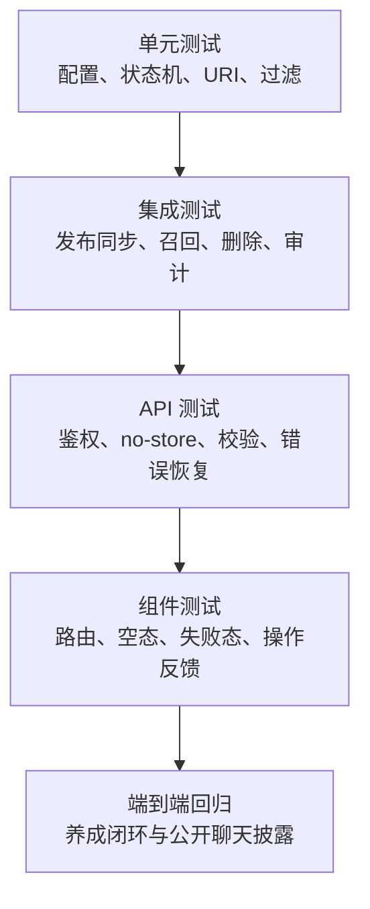

# 代表养成模块测试计划

日期：2026-07-31

## 1. 测试目标

验证“养成”闭环可用，并证明以下信任承诺真实成立：

- 未发布草稿不会进入 OpenViking。
- 不同访客之间不会通过 agent 全局记忆串漏。
- 支付、collector、handoff 和原始对话不会自动进入长期记忆。
- 停用或删除请求提交后，记录立即不可召回。
- 私有 Dashboard 数据不可缓存。
- 公开页对记忆行为的说明与实际配置一致。

## 2. 分层测试

## 3. 必测矩阵

| 领域 | 用例 | 预期 |
| --- | --- | --- |
| 导航 | 进入 `memory` 路由 | 展示“养成”，不展示静态 42/19/28 示例 |
| 训练 | 来源 → 建议 → 批准 | 更新知识草稿，生成养成修订并可查看变化 |
| 训练 | 批准建议但未发布代表版本 | 公开回答继续使用原 active version |
| 训练 | 拒绝或私有建议 | 不进入公开版本 |
| 训练 | 客户端伪造 evaluation report | 服务端忽略并重新评估 |
| 训练 | 重复或并发审核同一建议 | 只有第一次 PENDING 转换成功 |
| 训练 | 两个不同建议并发批准 | 两项变化都保留，不发生 KnowledgePack 丢更新 |
| 训练 | 批准与回滚并发 | 操作按代表串行，不产生修订与知识草稿不一致 |
| 训练 | 设置保存与批准/回滚并发 | 所有 KnowledgePack 写入按代表串行，双方改动不被静默覆盖 |
| 训练 | 先开始的事务后取得锁 | 修订号仍按实际提交顺序单调递增且不重复 |
| 训练 | 重复整理同一来源或问题 | 不覆盖已生成、已查看或已审核的建议草稿 |
| 训练 | 来源证据 A→B→A | 创建新的 A 代际；已审核 A/B 保持不可变，同一 origin 始终最多一条 PENDING |
| 训练 | 新旧 successor 反序批准 | 新版生效后旧版不可批准，不发生内容回退 |
| 训练 | 同一来源多次获批 | 使用稳定文档 ID 替换，不产生重复 FAQ、资料或规则 |
| 训练 | 两个 worker 并发生成同一 origin | partial unique 与事务锁保证最多一条 PENDING |
| 审计 | 客户端伪造 reviewedBy/rolledBackBy | 忽略客户端字段，只记录服务端认证 Owner |
| 训练 | 非公开 DO_NOT_SAY 反馈 | 不生成共享知识建议 |
| 修订 | 回滚最新养成修订 | 恢复知识草稿；active public version 保持不变 |
| 修订 | 回滚非最新或已被后续修改覆盖的修订 | 拒绝并提示 stale conflict |
| 修订 | 历史记录有多个 snapshotAfter 同时匹配当前草稿 | 拒绝歧义回滚，不猜测历史顺序 |
| 设置 | 过期 KnowledgePack revision 保存 | 返回 409、刷新最新草稿，不执行知识资产绑定 |
| 设置 | setup 已提交但知识绑定请求失败 | 客户端接纳新 revision，保留绑定选择并允许重试，不在下一次保存产生必然 409 |
| 同步 | 修改未发布草稿后同步 | OpenViking 内容仍来自 active version |
| 同步 | 尚无 active version | 返回 `blocked_unpublished` |
| 同步 | 发布/激活事务提交 | 对应版本的持久同步 job 必须同时存在 |
| 同步 | worker 在 claim 后中断 | 租约过期后重新接管并继续处理 |
| 同步 | 旧版本 job 晚于新版本完成 | 旧 job 只结算自身记录，不覆盖代表的最新同步状态 |
| 同步 | 远端临时失败 | 进入指数退避并在到期后自动重试 |
| 配置 | 提交字符串 `"false"` | 严格解析为 false 或拒绝，不得成为 true |
| 捕获 | Web/Telegram 原始会话 | 不创建长期 OpenViking 记忆 |
| 捕获 | 支付/collector/handoff | 不创建长期 OpenViking 记忆 |
| 隔离 | OpenViking 返回 agent URI | 不注入访客回答 |
| 隔离 | 返回其他联系人的 user URI | 不注入当前访客回答 |
| 召回 | 返回未登记 URI | 丢弃且不写召回记录 |
| 停用 | 停用活动记忆 | 请求成功后立即不可召回 |
| 删除 | 远端删除成功 | 本地状态为 Deleted |
| 删除 | 远端删除失败 | 本地仍不可召回，状态可重试 |
| 删除 | worker 在 DELETE_PENDING 后中断 | 租约过期后后台自动接管，记录始终不可召回 |
| 删除 | DELETE_FAILED 到达重试时间 | 自动重新进入删除流程，手动操作不是唯一恢复路径 |
| API | Dashboard GET/POST/PATCH/DELETE | 响应包含 `Cache-Control: private, no-store` |
| API | OpenViking 成功响应 | 不包含 URI、查询、分数、Agent/Session ID、服务端点或底层错误 |
| 公开端 | 记忆关闭 | 明确显示不会自动保留为长期记忆 |
| 公开端 | 记忆启用 | 显示用途和边界，不泄露内部 URI |
| 可访问性 | 状态与渠道颜色 | 同时有文本或 aria 标签，不能只靠颜色 |

## 4. 回归范围

- Creator Training 全量测试。
- OpenViking package 与 web-data 测试。
- Dashboard API、组件和路由测试。
- 公开代表页与聊天 API 测试。
- Bot 运行模式与消息处理测试。
- TypeScript 类型检查、lint、生产构建。

## 5. 人工 QA 路径

1. Owner 打开 Dashboard → 养成。
2. 登记一个可信来源并生成建议。
3. 分别验证批准、拒绝、私有三种动作。
4. 发布新版本，确认“记忆与使用”显示对应版本。
5. 修改草稿但不发布，触发同步，确认公开回答不变化。
6. 停用一条记忆，刷新并发起相同问题，确认不再召回。
7. 模拟远端删除失败，确认 UI 显示“已停用，删除待重试”。
8. 打开公开代表页，核对记忆披露与设置一致。
9. 使用两个不同联系人提出带个人信息的问题，确认上下文不串漏。

## 6. 通过标准

- 所有 P0 安全矩阵用例通过。
- 现有 Creator Training 测试无回归。
- 类型检查、仓库已配置的静态检查和生产构建通过。
- Dashboard 和公开端在桌面及窄屏下无阻断性布局问题。
- 最终代码复审没有 P0/P1 问题。

## 7. 最终回归结果

- 92 个 Prisma 迁移从空 PostgreSQL 数据库部署成功。
- 全仓测试在受控并发下 26/26 tasks 通过；`web-data` 单独顺序回归 1045 项通过。
- 养成 PostgreSQL 并发、代际、反序审核与回滚回归 11/11 通过。
- OpenViking PostgreSQL 同步、删除与恢复回归 3/3 通过。
- 全仓类型检查 19/19 tasks、生产构建 3/3 tasks 通过。
- Dashboard 在 1440×1000 与 390×844 下完成浏览器回归，控制台无错误；真实资料表单提交返回 200。
- 最终独立审查未发现 P0/P1/P2 问题。
